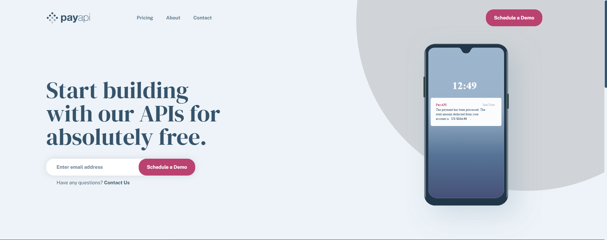

# payAPI Multi-Landing Page:

## Description

This app is a showcase for a frontend project, using React, Typescript and react-router-dom.

This project is meant to be a landing page for a payment API, where the user can see the different features of the API,
and also can subscribe to the service (API functionalities not implemented).

## Installation
run `npm install` to install all the dependencies.

## Usage
run `npm start` to start the app in development mode.

# Enjoy :)